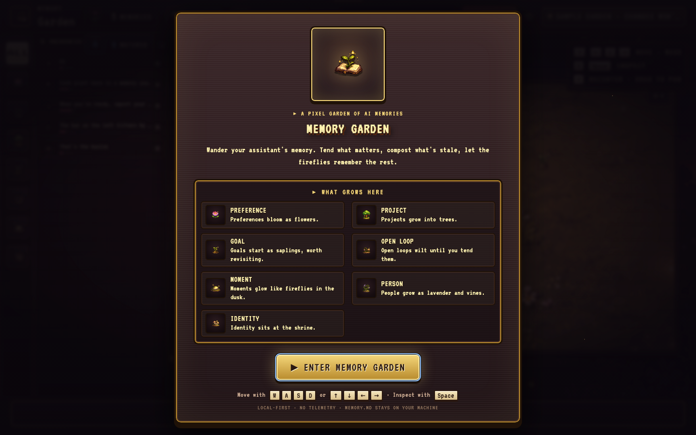
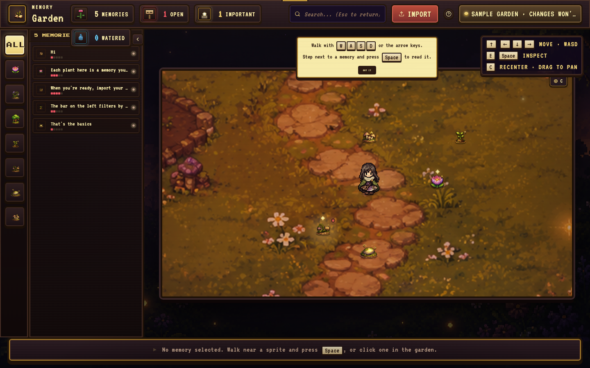
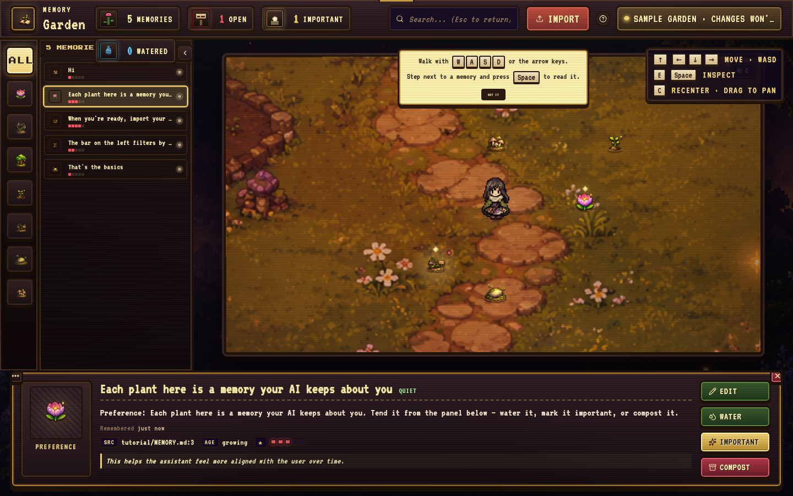
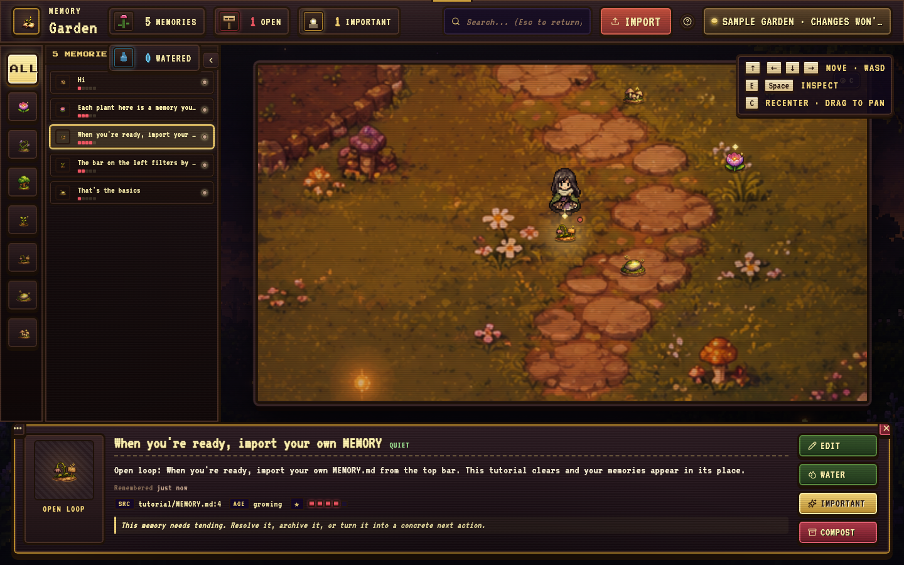

# Memory Garden

A pixel-art garden that visualizes what your AI assistant remembers about you.



Memory Garden reads a local `MEMORY.md` file (or any `.md` / `.txt` file) and turns each line into a plant. Walk around with WASD, water the ones you want to keep, forget the ones that don't feel right anymore. Edits sync back to the file as YAML frontmatter so the assistant actually sees the changes.

ChatGPT's memory page is a list. This is a place to walk through.

## What it looks like

A sample garden loads on first launch — a small tutorial world with five plants, your avatar near the center.



Walk up to a plant and press **Space** (or click) to open the inspector. Read the memory, edit it, water it, boost its importance, or compost / forget it.



A sidebar lists every memory in the current view. Click a row to fast-travel the avatar over and open the inspector in one motion.



## Memory kinds

The classifier sorts each line into one of seven kinds by looking at the text. Pick whichever metaphor fits the line; you can re-classify later.

| Kind | Sprite | Example |
|---|---|---|
| Preference | flower | "user prefers concise replies" |
| Person | lavender / vine | "ashley's sister is named …" |
| Project | tree | "working on a pixel-art garden in vite + react" |
| Goal | sapling | "wants to ship more side projects this year" |
| Open loop | signpost | "still need to write that follow-up email" |
| Moment | firefly | "the day we figured out the camera bug" |
| Identity | shrine | "assistant should be warm, honest, terse" |

## Controls

| Key | Action |
|---|---|
| Arrow keys / WASD | Walk |
| Space / E / Enter | Open the memory you're standing next to |
| Esc | Close inspector / cancel edit |
| C | Recenter camera on the avatar |
| Cmd/Ctrl + Enter | Save edit (while editing) |

Mouse works as a fallback for everything.

## Running it

```bash
npm install
npm run dev
```

Then open `http://localhost:5173` (or whichever port Vite picks).

To build:

```bash
npm run build
```

## Connecting a real memory folder

Click **Connect folder** in the top bar and pick a directory containing your AI's memory files. Memory Garden uses the browser's File System Access API to read and write them — nothing leaves your machine. Mutations (water, boost, edit, forget) are saved back as YAML frontmatter on the source file:

```yaml
---
first_seen: 2026-05-12T14:33:00.000Z
last_updated: 2026-05-16T09:14:22.000Z
importance: 4
watered: true
---
```

Files in `.compost/` are soft-deleted memories you can manually restore. Forget is a hard delete.

If you don't connect a folder, you can still play with the sample garden or drop a few `.md` / `.txt` files in via the import button — but changes won't survive a reload. The badge in the top right will tell you which mode you're in.

